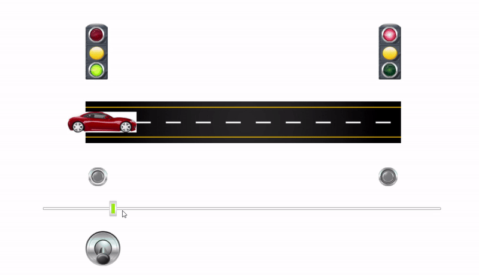

Single Lane Parking Control (PLC)

This project implements a PLC-based control system for a single-lane parking entrance and exit. Two traffic lights manage vehicle movement so only one vehicle can pass at a time. When a vehicle enters from one side, the opposite side is locked with a red light until the lane is clear.

Features

Single-lane traffic control

Two-way interlock logic

Traffic light control via PLC

Collision prevention

Application

Parking entrances/exits, narrow lanes, controlled vehicle access.

## 💻 PLC Program (Structured Text)
!(plc-code/main_program.st)

## 🎬 Project Demo

